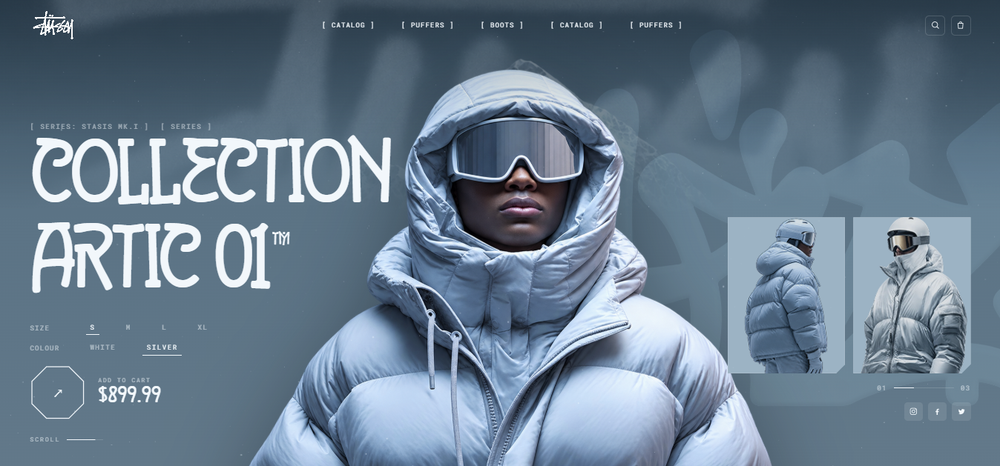

# ATM WEAR — Coleção Artic 01



Landing page de e-commerce recriada a partir de um layout de referência, com animação
de scroll e de entrada em GSAP, uma camada de neve em WebGL e sacola funcional.
Vite + JavaScript puro, sem framework.

## Rodar

```bash
npm install
npm run dev
```

`npm run build` gera `dist/`. `npm run preview` serve o build.

## Stack

| | |
|---|---|
| Build | Vite 7 |
| Animação | GSAP 3.15 — ScrollTrigger, ScrollSmoother, SplitText, DrawSVG, Flip, Observer, CustomEase |
| 3D | Three.js 0.180 |
| Tipografia | `BRIGEND` (local, em `public/fonts`) nos títulos · Roboto Mono nas linhas técnicas · Archivo no corpo |

Desde a versão 3.13 o GSAP publica todos os plugins no pacote público, então
ScrollSmoother, SplitText, DrawSVG e Flip vêm do `npm i gsap` normal.

## Estrutura

```
index.html              markup de todas as seções
src/styles/main.css     design system, layout e responsivo
src/js/
  main.js               boot, ordem de inicialização, helpers de dev
  gsap.js               registro único dos plugins + eases customizados
  preloader.js          intro (spray da assinatura + contador + cortina)
  nav.js                header sticky, hide-on-scroll, menu mobile
  anim.js               ScrollSmoother, entrada do hero, cenas de scroll,
                        card AURORA, UNIT ANATOMY, troca de looks do hero
  carousel.js           carrossel do "PRA QUEM USA, NÃO PRA OLHAR"
  cards.js              render dos cards + coreografia de hover/touch
  cart.js               sacola: estado, badge, gaveta e voo até o carrinho
  scribble.js           traços SVG da assinatura, em ordem de escrita
  data.js               catálogo de produtos
  three/frost.js        campo de neve em WebGL
tools/
  cutout.mjs            recorte de fundo dos PNGs de estúdio
  matte-from.mjs        transplante de alpha de um recorte pequeno pro original
```

## Seções

Hero com troca de looks · Nova Coleção (card AURORA + grid) · Manifesto ·
Pra quem usa, não pra olhar (carrossel) · Quando o frio chega · Inventário Ops Frio ·
Unit Anatomy · Footer com marquee.

## Implementação

### Cards de produto

A assinatura é desenhada com `DrawSVGPlugin` **atrás** do produto (`z-index` 1 contra
2). Isso só funciona porque os PNGs foram recortados — veja `public/product/cut/`.
Ao passar o mouse:

1. os traços da assinatura são desenhados em ordem de escrita;
2. sobe uma barra `#647d8e` com o preço e o *adicionar*;
3. o preço conta de `R$ 0,00` até o valor, e volta a zero ao sair.

A barra inteira é o botão de adicionar — o preço também é área de clique.

Onde não há hover, ou a tela é estreita, não existe hover pra revelar nada: a barra já
nasce levantada e o valor escrito. `gsap.matchMedia()` monta um dos dois caminhos e
desfaz o outro:

```
hover   : (hover: hover) and (min-width: 861px)
exposto : (hover: none), (max-width: 860px)
```

A largura faz parte da condição de propósito. Chavear só por `(hover: hover)` deixava
uma janela estreita de desktop — mouse presente em 375px — no caminho de hover, com o
preço escondido e nada pra revelá-lo.

### Sacola

Estado em memória, badge no ícone do header, gaveta com itens, quantidade, remoção e
total. Qualquer botão `[data-add]` funciona: ele lê o produto do `[data-product]` mais
próximo (`data-name`, `data-sub`, `data-price`, `data-img`), então cards, hero, AURORA
e a seção do frio usam o mesmo caminho.

Ao adicionar, um clone da foto voa até o ícone. `x` e `y` são animados com eases
diferentes, o que curva a trajetória em arco em vez de uma diagonal reta; o badge só
pulsa quando o clone chega, e o header é chamado de volta antes do voo começar — o
badge é o retorno visual, então precisa estar na tela.

Nos CTAs de seção a arte é **irmã** do `[data-product]`, não filha, então esses
declaram a origem do voo com `data-fly-from` (um seletor). O clone decola com no
máximo 260px: a arte do hero tem 760px e um clone desse tamanho atravessando a tela lê
como outro efeito.

Preços vivem como número em `data.js` e passam por `formatBRL()`, então card e sacola
não podem divergir.

### Carrossel

As três figuras *são* os slides. Avançar reordena os filhos no DOM e o **Flip** anima
a diferença, então cada figura viaja de verdade entre lateral e centro, mudando de
tamanho no caminho; a que sai do trilho passa por trás das outras. Nada troca `src`.

Uma timeline única governa a espera e a barra de progresso do dot — não dá pra
dessincronizar. **Observer** dá arrastar e swipe, setas do teclado navegam, e o
autoplay só roda com a seção na tela e fora de hover.

### Card AURORA

Abre com clip reveal, a assinatura é pintada atrás da peça com a mesma máscara de
traços dos cards, o título cai letra a letra (SplitText) e o chip de carrinho sobe. No
hover a assinatura é redesenhada e as letras dão uma onda.

### UNIT ANATOMY

Uma leitura técnica que se monta sozinha: a moldura abre em wipe, a peça assenta, as
linhas-guia se desenham até os pontos de ancoragem e as legendas entram pelas bordas.
São dois ScrollTriggers com `scrub` — um monta enquanto a seção chega, outro desmonta
enquanto ela sai, então rolar em qualquer direção toca o sentido certo. No mobile as
linhas somem e as legendas viram uma grade 2×2 abaixo da moldura.

### Three.js

Campo de neve: uma geometria, uma chamada de desenho, toda a movimentação no vertex
shader, `devicePixelRatio` limitado a 2, ticker único compartilhado com o GSAP, render
pausado com a aba em segundo plano e `dispose()` completo no teardown. Sem WebGL a
camada não é criada e a página segue igual.

O canvas fica **acima** do conteúdo com `mix-blend-mode: screen`, então precisa ser
esparso. Existia também um passe de névoa full-screen: em `screen` ele clareava tudo
que cobria e apagava os thumbs do hero e os links do menu. Foi removido — só a neve
ficou, e o canvas vai no máximo a `opacity .8`.

### Performance e acessibilidade

Só `transform` e `opacity` nas animações. `prefers-reduced-motion` desliga intro,
smoother e a camada WebGL. O preloader tem um timeout de segurança de 8s para o caso
de a aba abrir em segundo plano — o `requestAnimationFrame` é estrangulado ali e a
timeline não avançaria sozinha.

## Ferramentas de imagem

### `tools/cutout.mjs`

Um color key comum come os brilhos dentro da roupa, então a ferramenta faz *flood
fill* a partir da borda: só o fundo conectado à moldura é apagado. Depois fecha ruído
de compressão, descarta ilhas pequenas, erode as farpas da silhueta e suaviza a borda
do alpha. A decisão é tomada sobre uma cópia desfocada, senão os blocos de compressão
soldados na silhueta passam.

```bash
node tools/cutout.mjs public/product/3.png public/product/cut/3.png black 9 2 4 2
#                     <entrada>            <saída>                  <modo> <tol> <feather> <close> <erode>
```

Tolerâncias usadas: `20` na maioria, `8`–`9` nas peças pretas (3 e 12), senão o fill
vaza para dentro da roupa.

### `tools/matte-from.mjs`

O capacete branco do `banner-2` tem os mesmos valores do fundo de papel (243-251
contra 254-255), então nenhum threshold de luminância separa os dois: qualquer
tolerância que limpe a silhueta come a copa do capacete. O `banner2-mini.png` já vem
com matte correto, só que pequeno. Essa ferramenta registra o mini contra o frame
cheio — escala pela largura, deslocamento resolvido por IoU da silhueta, deu 0.970 — e
reamostra o alpha dele em resolução total.

```bash
node tools/matte-from.mjs public/banner/banner-2.png public/banner/banner2-mini.png public/banner/banner-2-cut.png 14
```

## Armadilhas registradas

Coisas que quebraram durante o desenvolvimento, todas anotadas no código:

- **Nunca coloque `transition` numa propriedade que uma tween do GSAP também anima.**
  O `from()` lê o valor computado do elemento para usar como destino; com uma
  transition em voo ele lê o valor intermediário. Foi o que aconteceu com `.thumb`: a
  transition em `opacity` fez o `from()` gravar `0` como destino, a tween rodou
  `0 → 0` e as miniaturas do hero ficavam no layout, clicáveis e invisíveis.
- **Valores em função no GSAP recebem `(index, target, targets)`**, não o elemento. Um
  `el.classList` derrubou o `initScenes` inteiro, e com ele o carrossel.
- **Flip mede o layout atual.** Qualquer tween ainda rodando nos mesmos elementos (a
  animação de entrada da seção) precisa ser concluída antes do `getState`. E como cada
  Flip deixa `opacity` inline, é preciso limpar antes do próximo, senão ele lê o valor
  velho como destino em vez da regra CSS do slot novo.
- **Altura percentual precisa de container com altura definida.** Num `grid` com
  trilhas automáticas ela fica indefinida e a imagem volta ao tamanho nativo. `flex`
  resolve, porque `aspect-ratio` dá altura definida ao container.
- **`line-height` abaixo da métrica da fonte estoura a caixa.** A BRIGEND reporta
  `winAscent + winDescent = 1.477em`; com `line-height: 1` e máscaras
  `overflow: hidden` os títulos ficavam cortados no topo. A solução foi manter a linha
  justa e dar o espaço só pra máscara (`padding-top` compensado por `margin-top`
  negativo), em vez de afrouxar o espaçamento.
- **Um throw dentro de um `boot()` async vira rejeição não tratada com stack
  truncada.** O `.catch` no `start()` existe por isso.

## Parâmetros de desenvolvimento

Só existem em `npm run dev` (`import.meta.env.DEV`), não vão para o build:

| Parâmetro | Efeito |
|---|---|
| `?intro=0` | pula o preloader e a animação de entrada |
| `?smooth=0` | desliga o ScrollSmoother (scroll nativo) |
| `?still=1` | desliga as animações de scroll (layout estático) |
| `?fast=6` | acelera a global timeline |
| `?hover=1` | força o estado de hover de todos os cards |
| `?solo=.cold` | renderiza só a seção informada no topo da página |
| `?y=1200` | rola até a posição após o boot |

Úteis para capturar telas: `?intro=0&smooth=0&still=1&solo=.collection`.

## Licença dos assets

A fonte BRIGEND é gratuita apenas para uso pessoal — veja
`public/fonts/brigend/Readme.txt`. Uso comercial exige licença do autor.
